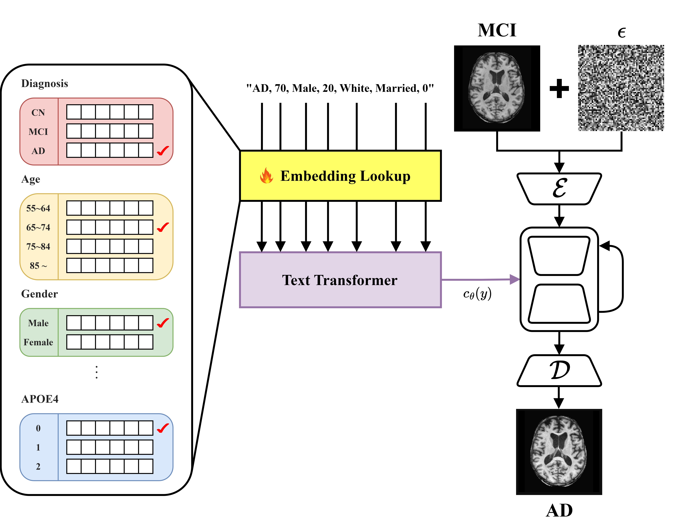
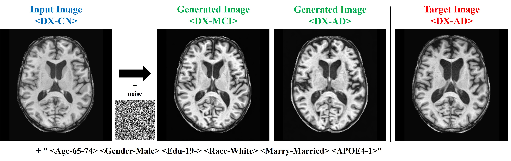

# MultimodalADProg
Clinical/Genetic Condition-based Model for Generating Brain T1 MRI Changes According to Alzheimer's Disease Progression

 

## Abstract
- Alzheimer's disease is a leading cause of dementia and the lack of effective treatment options highlights the critical need for early diagnosis and prediction of disease progression. 
- This study developed a diffusion model that integrates clinical and genetic data to generate T1-weighted MRI images corresponding to various stages of Alzheimer’s disease (CN, MCI, AD).
- Utilizing a pre-trained text-to-image model, Stable Diffusion, this approach generates medical images and overcomes challenges associated with medical terminology and domain shifts through textual inversion and fine-tuning techniques.
- Experimental results confirm that this model can effectively predict structural brain changes associated with the progression of Alzheimer’s disease by comparing generated MRIs with actual MRIs.
- This capability is anticipated to make significant contributions to early diagnosis and progression prediction.

 

## Model

 

## Results

### 1. Comparison of Generated and Actual MRI Performance Before and After Disease Stage Transition
Baseline was defined as the difference from the input MRI before the transition.

| |FID ↓|PSNR ↑|SSIM ↑|LPIPS ↑|
|:---:|:---:|:---:|:---:|:---:|
|Baseline|0.0017|24.5068|0.9309|0.0445|
|Ours|0.0105|23.5541|0.8953|0.0730|

Despite limitations in predicting fine structures due to noise addition, the improvement in LPIPS score demonstrates the model's ability to generate images aligned with human visual perception. This indicates that the model can effectively predict structural brain changes associated with Alzheimer's progression, even in the absence of long-term follow-up data.

### 2. Generated Structural Change Predictions According to Disease Stage Transition

